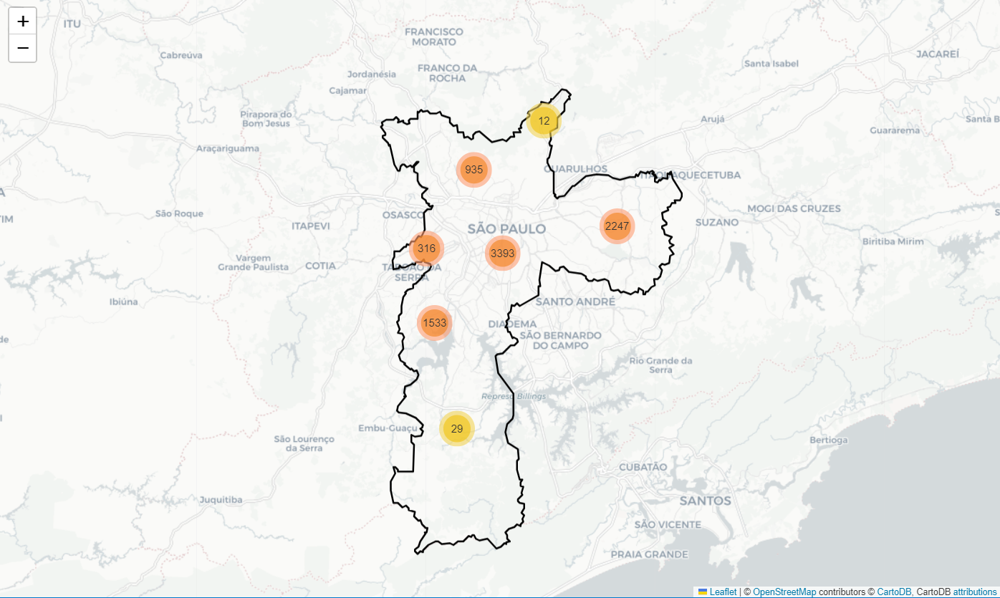

# SPSafe-GeoPandas
Classificação de Dados de Segurança Pública com SPSafe

Este repositório contém a implementação de uma análise e classificação de dados do dataset SPSafe, que abrange boletins de ocorrência registrados no estado de São Paulo entre os anos de 2003 e 2022. O SPSafe é um dataset padronizado que visa auxiliar gestores e pesquisadores na área de segurança pública ao fornecer dados consistentes e padronizados.

Objetivo do Projeto
O objetivo deste projeto foi realizar a classificação de roubos de celular na capital e região metropolitana de São Paulo, com foco em identificar padrões espaciais e temporais, utilizando a biblioteca GeoPandas para visualização e análise geoespacial dos dados. Foram gerados mapas característicos que mostram a distribuição espacial dos crimes, facilitando a análise de hotspots e tendências criminais ao longo do tempo.

Ferramentas Utilizadas
    -Python para manipulação de dados e construção de modelos de classificação.
    -GeoPandas para análise espacial e visualização de mapas.
    -Matplotlib e Seaborn para plotagem de gráficos e mapas geoespaciais.

Exemplos de Visualizações
Um exemplo de visualização gerada por este projeto inclui o seguinte mapa, que mostra a distribuição geográfica dos boletins de ocorrência no estado de São Paulo:

